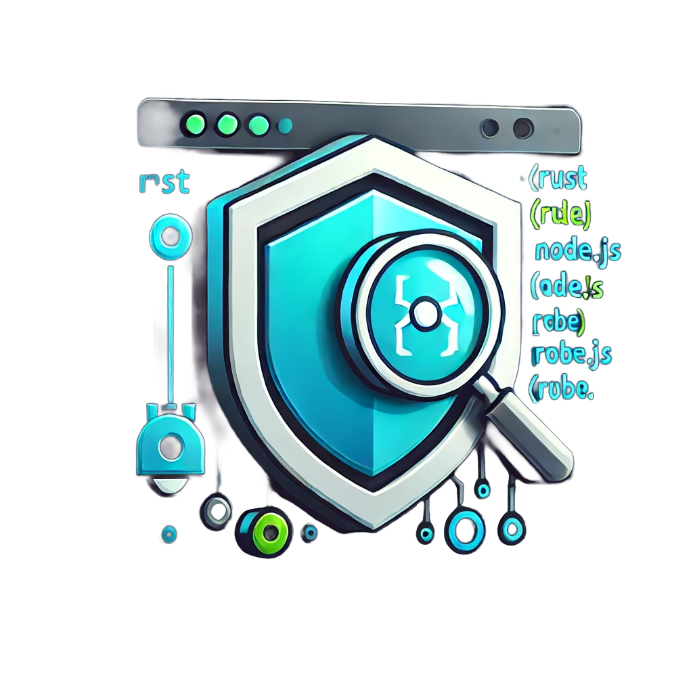

Depscan

Depscan is a dependency scanner extension for Visual Studio Code that helps you
identify vulnerabilities in your project's dependencies. It supports scanning
dependencies for Python, Node.js, Rust, Go, Ruby, and C/C++ projects.

## Authors:
- K.Vennela
- Larens Patel
- Rahul Kumar Jagat

## Features:

-Scans dependencies for vulnerabilities in Python, Node.js, Rust, Go, Ruby, and C/C++ projects.
-Displays scan results in a user-friendly table format.
-Supports scanning dependencies from various package managers, including:
-Python: pip
-Node.js: npm
-Rust: Cargo
-Go: Go Modules
-Ruby: Bundler
-C/C++: Makefile or CMakeLists.txt
-Allows users to view detailed information about each vulnerability, including its severity and description.

## Requirements:

To use Depscan, you need to have the following dependencies installed:

For Python: pipdeptree
For Node.js: npm
For Rust: Cargo
For Go: Go Modules
For Ruby: Bundler and bundler-audit
For C/C++: cppcheck
You can install these dependencies by running the following commands:

For Python:
pip install pipdeptree
For Node.js: Download and install Node.js from https://nodejs.org/
For Rust: Download and install Rust from https://www.rust-lang.org/tools/install
For Go: Download and install Go from https://golang.org/dl/
For Ruby:
gem install bundler
gem install bundler-audit
For C/C++: Install cppcheck via your package manager (e.g., apt, brew, etc.).
Extension Settings

Depscan does not contribute any VS Code settings.

## Known Issues:

Depscan may not work correctly if your project has a complex dependency structure.
Depscan may not be able to scan dependencies for projects that use custom package managers.
Release Notes
1.0.0: Initial release of Depscan.
1.0.1: Fixed issue with scanning dependencies for Node.js projects.
1.1.0: Added support for scanning dependencies for Rust, Go, Ruby, and C/C++ projects.

